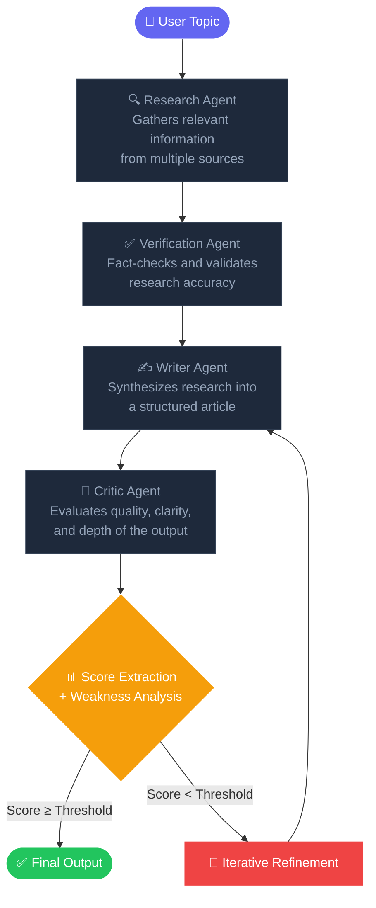

Perfect.
We’re going to write this like a serious AI systems engineer, not like a student.

Below is a production-level README.md ready to paste into your GitHub repo.

📄 README.md
# 🧠 Astraeus AI  
### Autonomous Multi-Agent Research & Evaluation Engine

Astraeus AI is a modular, production-oriented multi-agent research engine that performs structured research, verification, writing, critique, and quality evaluation using large language models.

Built as a personal AI systems engineering project to explore autonomous agent orchestration, iterative refinement loops, and research quality scoring.

---

## 🚀 Overview

Astraeus AI simulates a structured research workflow using multiple AI agents:

1. Research Analyst  
2. Fact Verification Specialist  
3. Technical Writer  
4. AI Output Critic  

The system:
- Generates structured research
- Verifies factual consistency
- Produces a formatted technical report
- Critiques and scores the output
- Iteratively refines until quality threshold is met

It exposes:
- 🖥 FastAPI backend (LLM orchestration)
- 🌐 Streamlit dashboard (interactive UI)
- 🔁 Iterative evaluation loop
- 📊 Score extraction and weakness detection

---

## 🏗 Architecture

### Multi-Agent Pipeline


### Backend
- FastAPI REST API
- CrewAI multi-agent orchestration
- Local LLM via Ollama
- Score parsing & weakness detection modules

### Frontend
- Streamlit dashboard
- Glassmorphism UI
- Sectioned report visualization
- Export (Markdown / JSON)

---

## 🧰 Tech Stack

- Python 3.10+
- CrewAI
- Ollama (Local LLMs)
- FastAPI
- Uvicorn
- Streamlit
- Pydantic

---

## 📂 Project Structure

```
User Topic
    ↓
Research Agent        →  Gathers information from multiple sources
    ↓
Verification Agent    →  Fact-checks and validates accuracy
    ↓
Writer Agent          →  Synthesizes into a structured report
    ↓
Critic Agent          →  Evaluates quality, clarity, and depth
    ↓
Score Extraction + Weakness Analysis
    ↓
Iterative Refinement  →  Loops back to Writer if score < threshold
    ↓
Final Output
```

---

## ⚙️ Installation

### 1️⃣ Clone the repository

```bash
git clone https://github.com/YOUR_USERNAME/astraeus-ai.git
cd astraeus-ai
```

### 2️⃣ Create virtual environment
python -m venv .venv
source .venv/bin/activate  # Linux / Mac
.venv\Scripts\activate     # Windows

### 3️⃣ Install dependencies
pip install -r requirements.txt

## 🧠 LLM Setup (Ollama)
Install Ollama and pull a model:
ollama pull llama3.1:8b
ollama pull llama3.1:8b

## ▶️ Running the Backend
From project root:
uvicorn app.api:app --reload

API docs:
http://127.0.0.1:8000/docs

## 🌐 Running the Dashboard
In a new terminal:
streamlit run dashboard/app.py

Access:
Access: http://localhost:8501

## 📊 Example Output Format
SCORE: 8

STRENGTHS:
- ...
- ...

WEAKNESSES:
- ...
- ...

IMPROVEMENTS:
- ...
- ...

## 🎯 Key Features

- Modular multi-agent architecture
- Iterative quality refinement loop
- Automatic score extraction
- Weakness counting engine
- Research critique system
- Exportable reports
- Production-style backend/frontend separation

## 🧪 Design Goals
- Explore autonomous AI agent collaboration
- Simulate structured research workflows
- Implement measurable output quality evaluation
- Build system-level AI engineering skills

## 👨‍💻 Future Improvements
- RAG integration
- Vector database memory
- Multi-model ensemble evaluation
- Advanced metric scoring (precision/recall scoring engine)
- Deployment to cloud infrastructure
- CI/CD integration

👨‍💻 Author

Devdutt S

Personal upskilling project focused on building real-world AI systems architecture.

## 📜 License
MIT License


